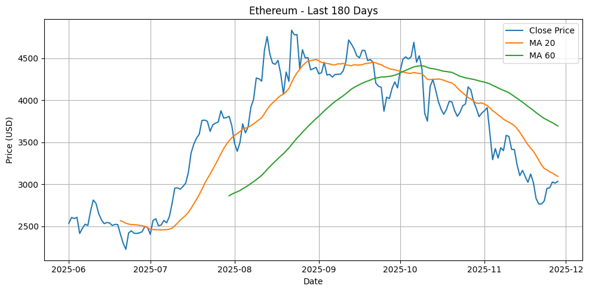
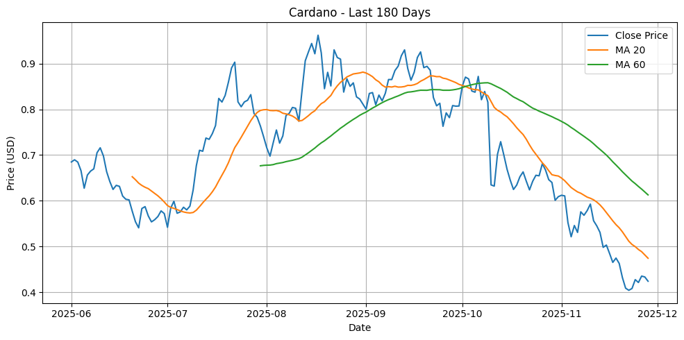
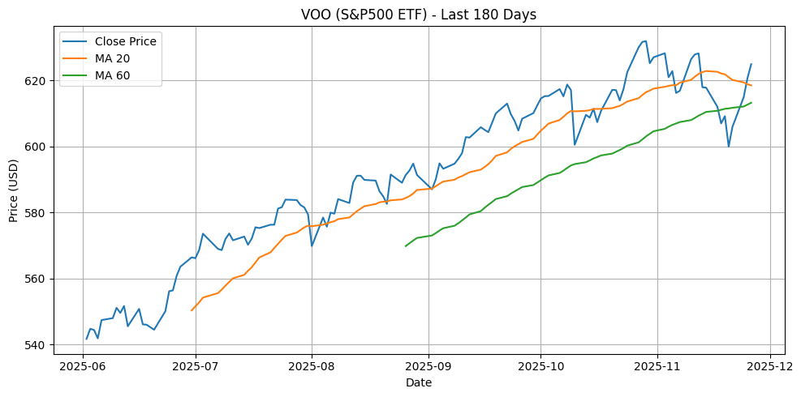

# Crypto Market Trend Analysis using Moving Average Models

**Author:** Pei Zhang  
**Last updated:** 2025-11-29  

A Python-based quantitative study on price momentum behavior in major crypto assets using MA20/MA60 crossover signals, benchmarked against VOO to evaluate structural volatility differences vs traditional equities.

---

## 1️⃣ Research Objective

This project analyzes:

- **Short-term (MA20)** vs **mid-term (MA60)** trend strength
- **Momentum persistence** vs **momentum reversals**
- Differences in behavior between **crypto** & **equity** assets

It is part of my journey into **FinTech & Crypto Quant Research**  
with focus on **market momentum, volatility regimes and strategy signals**.

---

## 2️⃣ Assets & Data

| Asset | Type | Role in Study |
|---|---|---|
| BTC | Digital asset | Liquidity & trend anchor |
| ETH | Smart contract ecosystem | High narrative sensitivity |
| ADA | High-beta altcoin | Volatility exposure indicator |
| VOO | Equity index ETF | Traditional benchmark |

**Source:** Yahoo Finance via `yfinance`  
**Granularity:** Daily close prices  
**Period:** Latest 180 days (rolling)

---

## 3️⃣ Methodology (MA20 vs MA60)

- **MA20 > MA60** → strong bullish momentum
- **MA20 < MA60** → bearish momentum dominance
- **Crossovers** often mark **trend shifts**

Quant formula:

\[
MA_{n}(t) = \frac{1}{n}\sum_{i=0}^{n-1} P_{t-i}
\]

Used to assess:

✔ trend reliability  
✔ ease of reversals  
✔ speculation intensity  

---

## 4️⃣ Price Momentum Analysis & Insights

---

### 🔹 BTC — Most stable trend structure


**Observations**
- Clearer MA20/MA60 separation in uptrends
- Fewer false crossovers
- Converges smoothly in corrections

**Interpretation**
- **Highest liquidity** and **institutional presence**
- More reliable signal structure  
→ BTC remains the **sentiment anchor** for crypto

---

### 🔹 ETH — Narrative-driven volatility



**Observations**
- More frequent crossovers
- Rallies fade quickly near MA60
- Narrower momentum spreads vs BTC

**Interpretation**
- Momentum sensitive to **ecosystem narratives**
- Requires **tighter risk control**
- Trend reliability below BTC

---

### 🔹 ADA — High noise, weak trend persistence



**Observations**
- Most noisy momentum behavior
- Short trend cycles + abrupt reversals
- Frequent whipsaws

**Interpretation**
- **Speculative & retail-heavy**
- Signal reliability very low  
→ Higher beta, higher drawdown risk

---

### 🔹 VOO — Smooth institutional trend baseline



**Observations**
- Much slower trend shifts
- Very few crossovers
- Lower volatility regime

**Interpretation**
- Reflects **fundamental-driven capital flows**
- Excellent baseline for contrast  
→ Shows crypto momentum is **amplified & unstable**

---

## 5️⃣ Key Insights (so far)

| Insight | Meaning |
|---|---|
| Crypto reverses momentum more often | Higher emotional trading |
| BTC > ETH > ADA (trend reliability) | Liquidity sensitivity hierarchy |
| BTC leads market direction | Macro structural dominance |

⚠️ Not investment advice — Research purpose only

---

## 6️⃣ Current Limitations

- Only MA indicator → no multi-factor confirmation
- No Sharpe / drawdown evaluation yet
- No signal backtesting yet
- Results vary by time window

📌 These will be solved in future updates.

---

## 7️⃣ Future Work & Roadmap 🚀

| Phase | Focus | Why it matters |
|---|---|---|
| ① Volatility Analysis | Rolling std | Risk comparison |
| ② Sharpe Ratio | Risk-adjusted returns | Performance evaluation |
| ③ BTC-Beta & Correlation | Cross-asset structure | Institutionalization trends |
| ④ Strategy Backtest | Crossover vs HODL | Practical feasibility |

➡ These upgrades will transform this into a **quant strategy research project**

---

## 8️⃣ Run the Notebook

### A — Local environment

```bash
git clone https://github.com/peizhang-felix/crypto-ma-analysis.git
cd crypto-ma-analysis
pip install yfinance pandas matplotlib numpy
jupyter notebook
Run → crypto_ma_analysis.ipynb

B — Run online (Google Colab)

🔗 https://github.com/peizhang-felix/crypto-ma-analysis/blob/main/crypto_ma_analysis.ipynb

⸻

9️⃣ Tech Stack
	•	Python · pandas · numpy · matplotlib · yfinance
	•	Quant Analysis · Time Series Visualization
	•	Market Structure & Momentum Behavior Research

⸻

🔟 About the Author

Pei Zhang
Aspiring FinTech & Crypto Data Analyst
Focus on algorithmic market analysis & quant strategy foundations

More projects coming soon
Collaboration is welcome!
